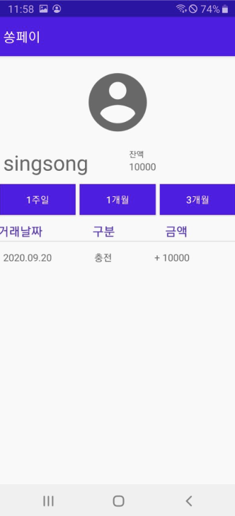
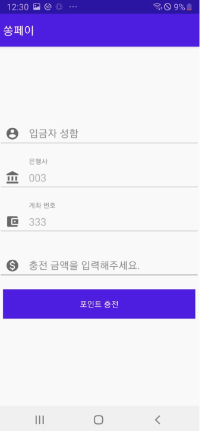
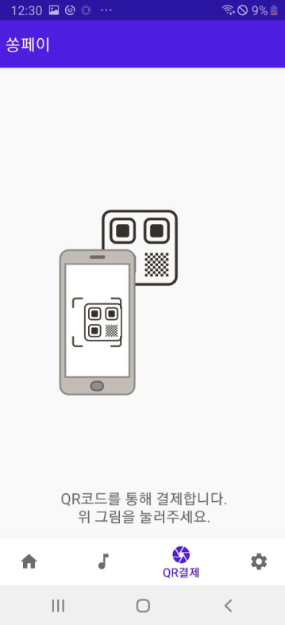
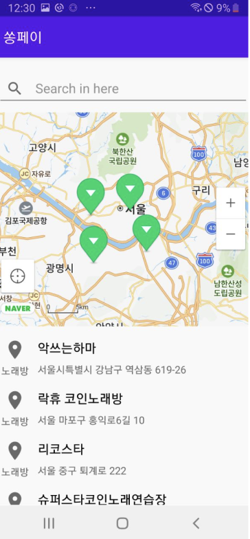
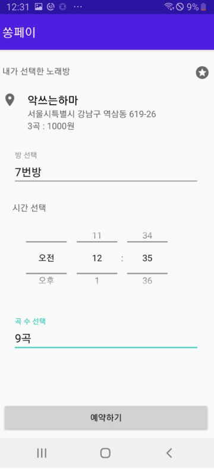
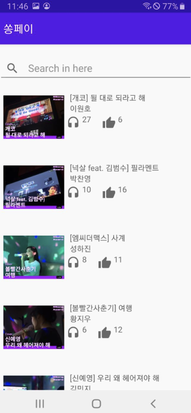
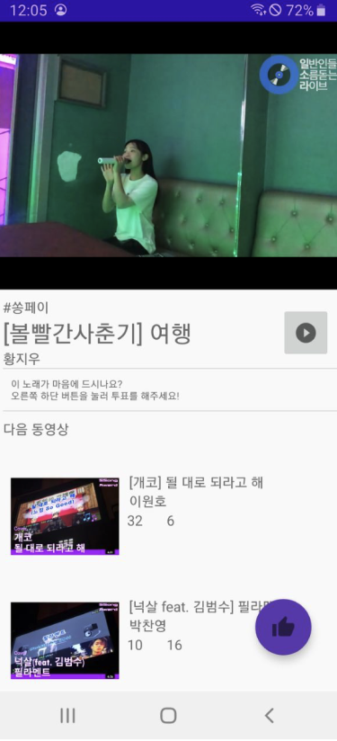
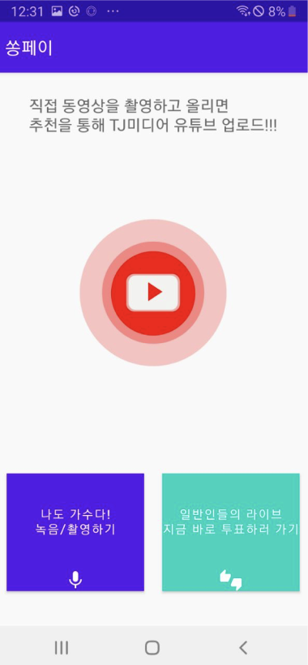
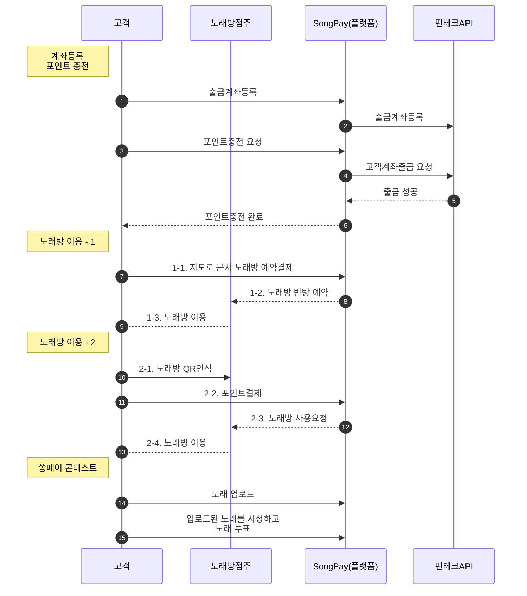

# 제 8회 핀테크 해커톤 공모전

## 씽송 팀 - SongPay(코인노래방 간편결제 서비스)

> 현금이나 카드 결제가 필요없는 간편 결제 노래방 서비스

- <a href="https://github.com/Dolphin-PC" target="_blank">박찬영</a>(팀장 / 개발(Android-Front), 기획)
- <a href="https://github.com/MinzyKim" target="_blank">김민지</a>(팀원 / 개발(Back-End, DB), 기획)
- <a href="https://github.com/BONOBONOBOo" target="_blank">이원호</a>(팀원 / 개발(Back-End, API))
- <a href="https://github.com/scalarH" target="_blank">황지우</a>(팀원 / 개발(Android-Front), 기획, 디자인)

## 수상 - 최우수상

## 개발 스택

- Front-End : Android
- Back-End : [Spring](https://github.com/fintech-hackathon/spring)
- Database : mysql
- API : Open Banking API(via 쿠콘) (거래내역, 상품권잔액조회, 입금/출금 이체 등)
- Others : 네이버 지도 API, 유튜브 API

## 서비스 주요기능

### 1. 포인트(상품권)잔액 조회

- **쿠콘의 상품권 잔액조회 API를 활용**하여, 충전된 상품권 내역을 조회합니다.
- 

### 2. 계좌출금 및 포인트(상품권) 충전

- **쿠콘의 상품권 구매API 활용**하여, 포인트를 충전합니다.
- 

### 3. QR인식 및 포인트 결제

- [zxing 라이브러리](https://github.com/journeyapps/zxing-android-embedded)를 활용하여 QR기능을 구현하였고, 이를 통해 포인트 결제를 진행합니다.
- 

### 4. 내 근처 노래방 찾기

- [네이버지도 API](https://www.ncloud.com/product/applicationService/maps)를 활용하여, 내 주변의 노래방을 검색합니다.
- 

### 5. 노래방 예약하기

- 노래방에 방문하기 전, 선결제를 통해 노래방을 예약합니다.
- 

### 6. 쏭어워즈

- 일반인들의 노래를 업로드하고, 투표하는 경연대회입니다.
-   

### 결과물

- [SSong Pay PPT](https://fintech-hackathon.github.io/SongPay/SSongPay%20PPT.pdf)
- [서비스 디자인(Figma)](https://www.figma.com/file/b302LrYEx1QCy2B774Nktg/SSongPay_Android?type=design&node-id=0-1&mode=design&t=vBRsfKlCwSU6bRev-0)
- [서비스 플로우(Figma)](https://www.figma.com/proto/b302LrYEx1QCy2B774Nktg/SSongPay_Android?type=design&node-id=165-18&t=vBRsfKlCwSU6bRev-0&scaling=scale-down&page-id=0%3A1&starting-point-node-id=165%3A18)

---

### 서비스 흐름도

### 서비스 내용

#### 주요 고객

- 코인노래방을 이용하는 2030 혼족

#### 경쟁력

- "현금없는 시대"에 코인노래방 이용객의 편의 증가 및 스트리밍을 통한 노래방 이용객들간의 커뮤니티 형성
- SongPay 서비스의 결제 방식은 코인(포인트) 충전이므로 클라이언트(업주)들의 PG사/카드결제 수수료 절감 효과

#### 특징

- 쏭어워드\*(커뮤니티 내 투표 결과 상위 5위 참가자의 노래는 TJ미디어 유튜브에 업로드)
- 스트리밍 서비스\*(경연 참가자들의 노래를 홍보 콘텐츠로 사용하여 기존/잠재적 고객의 관심을 유치)

#### 기대효과

- 현금 없이도 코인노래방 서비스 이용가능, 방문 없이도 빈방 조회 가능 => 코인노래방의 이용자수 증대효과
- 간편 결제\*(이용자의 결제 편의 증대, 낮은 수수료로 협업사 이익 증대)

#### 수익모델

- TJ미디어의 기존, 잠재고객들을 앱에 홍보,노출을 대가로 한 홍보비
